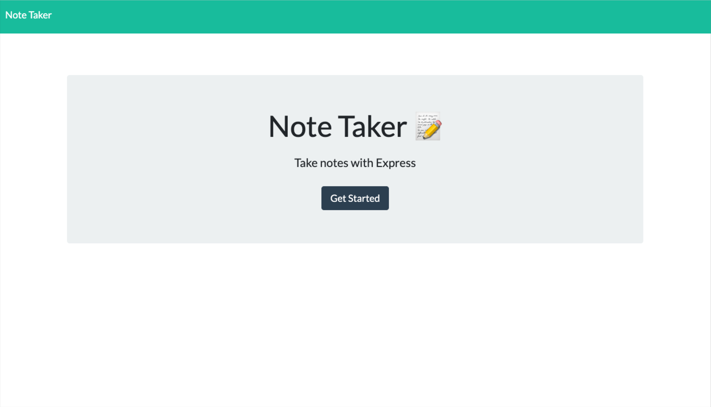
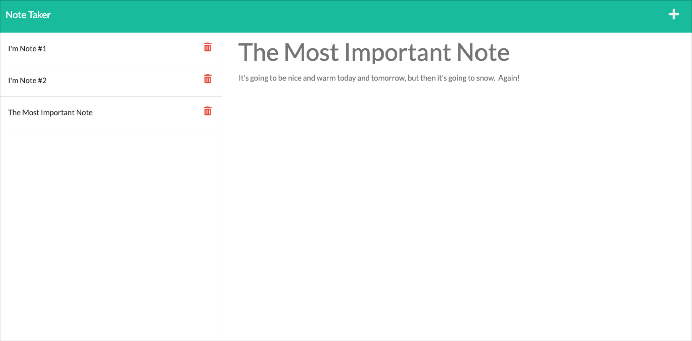

# HOMEWORK #11 - NoteTaker
The Note Taker code can be found here:

ttps://github.com/mtnbiker72/note-taker  

## Required Modules:
* express

## Description Summary
The Note Taker app allows a small business owner to write, save, and delete important notes that they take. The app was deployed in heroku and files can be found in github. 

## Acceptance criteria

 * Once you click on the main landing page, a new notes page shows up
 * Existing notes will show up on the left and the ability to write a note on the right
 * When you add a new note with description, a save icon appears
 * The user can click on the save icon and the note moves to the left column
 * When the user clicks on an existing note, the heading and text appear on the right
 * If the user clicks on new note, any note that is displayed is replaced with a blank place for the user to add a new note
 * When the user selects the delete button next to a note, it will be removed from the notes list and removed from the file

## Usage
Run from the heroku website - 
https://guarded-tor-62571.herokuapp.com/

## Pictures
            
            